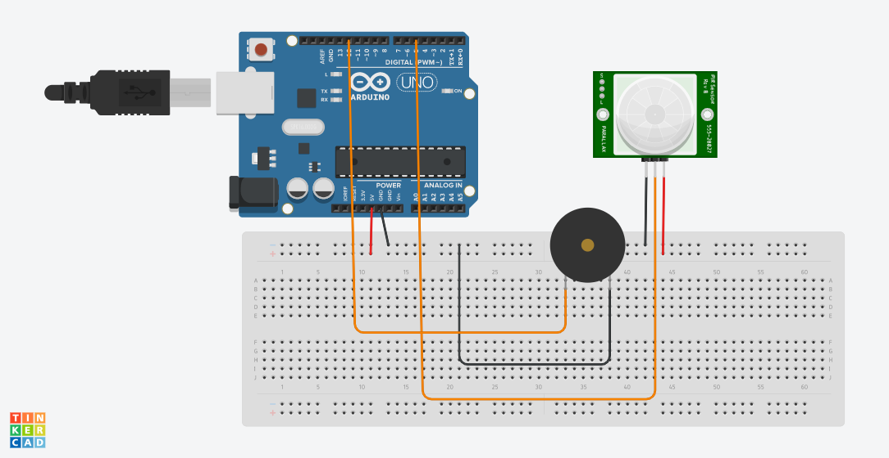

# arduino motion sensor with a buzzer
## Arduino project using motion sensor and an active buzzer, to play sound when someone moves in front of sensor

In this project I use the following components:

- Arduino (I used a Mega, but you can use any other)
- HC-SR501 PIR Motion Sensor
- Active Buzzer
- Jumpers (4 males and 2 females)
- Protoboard

You will also need the Arduino IDE. You can download it here: [Arduino IDE](https://www.arduino.cc/en/software)

NOTE: This project does not use any external library. Everything you´ll need is already installed within the IDE.

Here's the schematic:

Once you have connected all components, compile the sketch and upload it to the Arduino. The buzzer will play if anyone move in front of the motion sensor. 

